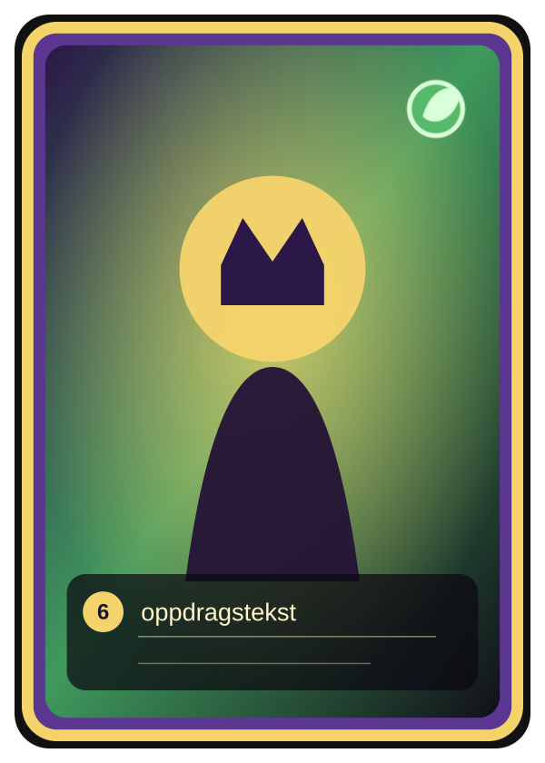
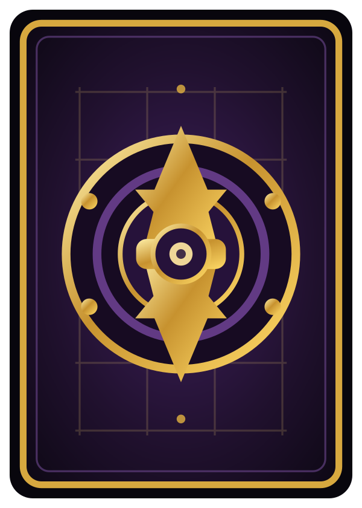

[Back](../../README.md)

# Kongekort

## Navigasjon

* [Aktivt regelutkast](gameidea-working.md)
* [Terrengkort](terrain-cards.md)
* [Monsterkort](monster-cards.md)

---

Kongekort viser spillerens konge, liv og offentlig oppdrag. Kortene er primært ikonbaserte: korttypen leses av den kongelige rammen og baksiden, mens elementfokus vises med ikon og fargestemning.

PNG-bildene under viser kortpreviewene. SVG-kildene ligger i [`images/svg/`](images/svg/), og ikonene ligger i [`images/svg/icons/`](images/svg/icons/).

 

## Ikoner

* Nøytral: stein/sirkel
* Gress: blad
* Flamme: flamme
* Vann: dråpe
* Liv: tall eller livsmarkør

## Kortliste

| kort_id | elementfokus | liv | offentlig_oppdrag | kortnotat |
|---|---|---:|---|---|
| `king_neutral_0_a` | nøytral | 6 | Ødelegg en motstanders konge. | Direkte kongejakt. |
| `king_neutral_0_b` | nøytral | 6 | Kontroller 5 terreng. | Bred områdekontroll. |
| `king_grass_0_a` | gress | 6 | Kontroller 3 gressressurser og 4 terreng. | Gressbasert kontrollmål. |
| `king_grass_0_b` | gress | 6 | Ha minst 5 bønder på kontrollerte terreng og kontroller 2 gressressurser. | Bonde- og ressursmål. |
| `king_flame_0_a` | flamme | 6 | Vinn 2 kamper som angriper og kontroller 2 flammeressurser. | Aggressivt kampmål. |
| `king_flame_0_b` | flamme | 6 | Ha påført minst 3 skade på kongeliv totalt og kontroller 3 flammeressurser. | Presser konger. |
| `king_water_0_a` | vann | 6 | Kontroller 3 vannressurser og ha kongen på et terreng uten fiendtlige bønder. | Trygg sluttposisjon. |
| `king_water_0_b` | vann | 6 | Kontroller 2 vannressurser, 2 nøytrale ressurser og minst 4 terreng. | Balansert kontrollmål. |
