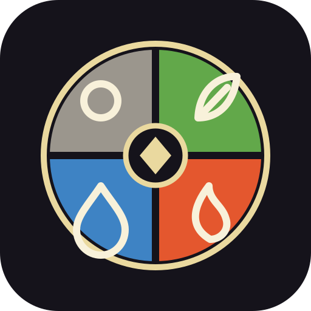

[Back](../../README.md)

# Conquora-Logokonsept

[`images/svg/conquora_logo.svg`](images/svg/conquora_logo.svg) er den kanoniske kilden for det første logo- og ikonkonseptet til Conquora.

## Struktur

Merket er en sirkel delt i fire like sektorer rundt ett felles sentrum. Strukturen representerer fire konkurrerende eller samvirkende krefter uten å gjøre det gjenbrukbare Conquora-systemnavnet avhengig av én bestemt utgave.

For **Elements: Conquora** er sektorene:

* Nøytral: steinsirkel og grå
* Gress: blad og grønn
* Flamme: flamme og oransje
* Vann: dråpe og blå

Ytterringen, firesektorstrukturen, det mørke sentrumet og diamanten i midten danner den gjenkjennelige Conquora-silhuetten. Fremtidige utgaver kan erstatte de fire sektorfargene og symbolene med egne fraksjoner, hus, dimensjoner eller andre kategorier, men beholde den samme rammen.

## Bruk

* Behold fire like sektorer i det primære systemmerket.
* Behold tydelig skille mellom sektorene, slik at ikonet er lesbart i liten størrelse.
* Bruk den kanoniske SVG-filen i `shared/docs` som designkilde.
* Kopier brukt av applikasjoner eller eksport skal beholde samme geometri og dokumentere eventuelle avvik.
