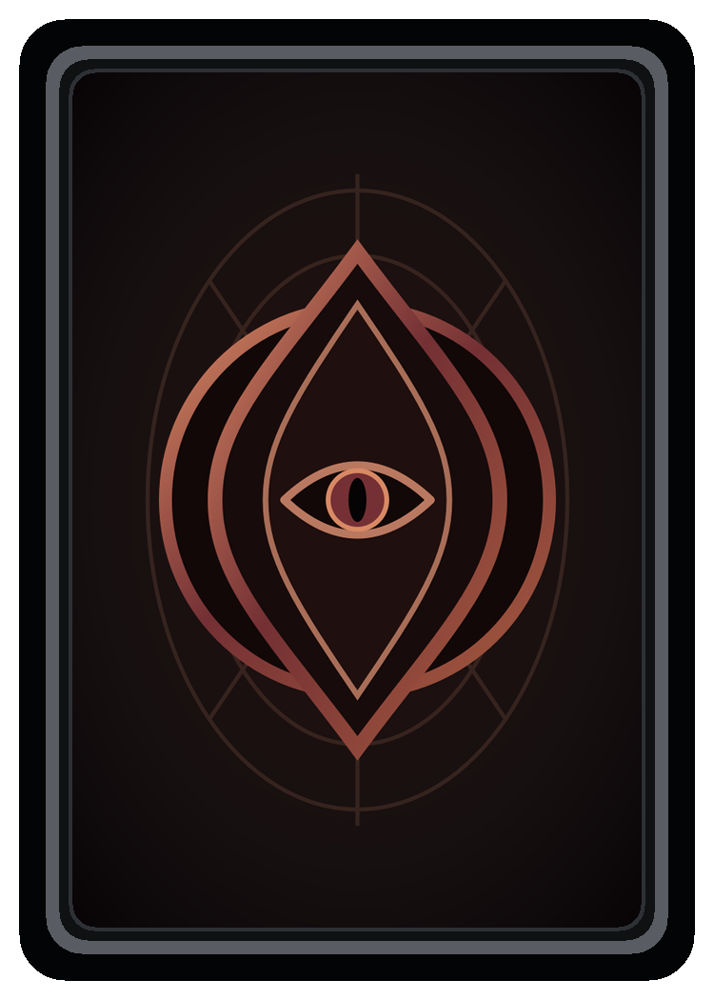

[Back](../../README.md)

# Monsterkort

## Navigasjon

* [Aktivt regelutkast](gameidea-working.md)
* [Terrengkort](terrain-cards.md)
* [Felles kortutseende](card-appearance.md)

---

Denne kortlisten er source of truth for monsterkortene i defaultutgaven **Elements: Conquora**.

Monsterkort er kampverktøy. Standardstokken har 32 monstre: åtte per element, fordelt som 4 Tier 1, 3 Tier 2 og 1 Tier 3.

Kortgeneratoren bygger forsiden rundt et fullt bakgrunnsbilde. Den delte dokumentasjonen inneholder derfor ikke lenger en eksempel-front; ikonene ligger i [`images/svg/icons/`](images/svg/icons/), og baksiden ligger i [`images/svg/monster_card_back.svg`](images/svg/monster_card_back.svg).

## Kortutseende

Monsterets eksplisitte element vises øverst til høyre og er uavhengig av ressurskravene. Tier vises som én til tre små kobberdiamanter ved elementmedaljongen. Farger, medaljongstil, bakside og printsoner følger [felles spesifikasjon for kortutseende](card-appearance.md). Portrettmotivene planlegges i [manifestet for kortillustrasjoner](card-artwork.md).

## Ikoner Og Styrke

Kravikonene øverst må oppfylles og betales når monsteret brukes. Styrkeikonet viser grunnstyrken. Bonuslinjer bruker formen `gjenværende ressursikoner -> styrkeikon` og er kumulative.

Elementfordel gir fortsatt `+1 styrke` i tillegg til monsterets grunnstyrke og bonuslinjer. `Valgfri` i et krav betyr én ressurs av valgfri type.

## Kortliste

| kort_id | element | tier | krav | styrkeikon | bonus_1 | bonus_2 | effekt | maks_styrke_før_elementfordel |
|---|---|---:|---|---:|---|---|---|---:|
| `monster_neutral_1_a` | nøytral | 1 | `stein` | 1 | Ingen | Ingen | Ingen | 1 |
| `monster_neutral_1_b` | nøytral | 1 | `2 stein` | 1 | `1 stein -> 1 styrke` | Ingen | Ingen | 2 |
| `monster_neutral_1_c` | nøytral | 1 | `stein` | 1 | `1 stein -> 1 styrke` | Ingen | Ingen | 2 |
| `monster_neutral_1_d` | nøytral | 1 | `2 stein` | 2 | Ingen | Ingen | Ingen | 2 |
| `monster_neutral_2_a` | nøytral | 2 | `2 stein` | 2 | `1 stein -> 1 styrke` | Ingen | Ingen | 3 |
| `monster_neutral_2_b` | nøytral | 2 | `2 stein` | 1 | `1 stein -> 1 styrke` | `2 stein -> 1 styrke` | Ingen | 3 |
| `monster_neutral_2_c` | nøytral | 2 | `3 stein` | 2 | `1 stein -> 1 styrke` | Ingen | Ingen | 3 |
| `monster_neutral_3_a` | nøytral | 3 | `3 stein` | 2 | `1 stein -> 1 styrke` | `2 stein -> 1 styrke` | Reduser mottatt bondetap med 1. | 4 |
| `monster_grass_1_a` | gress | 1 | `blad` | 1 | Ingen | Ingen | Ingen | 1 |
| `monster_grass_1_b` | gress | 1 | `1 stein, 1 blad` | 1 | `1 blad -> 1 styrke` | Ingen | Ingen | 2 |
| `monster_grass_1_c` | gress | 1 | `2 blad` | 1 | `1 blad -> 1 styrke` | Ingen | Ingen | 2 |
| `monster_grass_1_d` | gress | 1 | `1 stein, 1 blad` | 2 | Ingen | Ingen | Ingen | 2 |
| `monster_grass_2_a` | gress | 2 | `1 stein, 2 blad` | 1 | `1 blad -> 1 styrke` | Ingen | Ingen | 2 |
| `monster_grass_2_b` | gress | 2 | `2 stein, 1 blad` | 2 | `2 blad -> 1 styrke` | Ingen | Ingen | 3 |
| `monster_grass_2_c` | gress | 2 | `2 stein, 2 blad` | 2 | `1 blad -> 1 styrke` | Ingen | Ingen | 3 |
| `monster_grass_3_a` | gress | 3 | `3 stein, 2 blad` | 2 | `1 blad -> 1 styrke` | `2 blad -> 1 styrke` | Reduser mottatt bondetap med 1. | 4 |
| `monster_flame_1_a` | flamme | 1 | `flamme` | 1 | Ingen | Ingen | Ingen | 1 |
| `monster_flame_1_b` | flamme | 1 | `1 stein, 1 flamme` | 1 | `1 flamme -> 1 styrke` | Ingen | Ingen | 2 |
| `monster_flame_1_c` | flamme | 1 | `1 flamme, 1 valgfri` | 1 | `1 flamme -> 1 styrke` | Ingen | Ingen | 2 |
| `monster_flame_1_d` | flamme | 1 | `1 stein, 1 flamme` | 2 | Ingen | Ingen | Ingen | 2 |
| `monster_flame_2_a` | flamme | 2 | `1 stein, 2 flamme` | 1 | `1 flamme -> 1 styrke` | Ingen | Ingen | 2 |
| `monster_flame_2_b` | flamme | 2 | `2 stein, 1 flamme` | 2 | `2 flamme -> 1 styrke` | Ingen | Ingen | 3 |
| `monster_flame_2_c` | flamme | 2 | `2 stein, 2 flamme` | 2 | `1 flamme -> 1 styrke` | Ingen | Ingen | 3 |
| `monster_flame_3_a` | flamme | 3 | `3 stein, 2 flamme` | 2 | `1 flamme -> 1 styrke` | `2 flamme -> 1 styrke` | Rull én angrepsterning på nytt. | 4 |
| `monster_water_1_a` | vann | 1 | `dråpe` | 1 | Ingen | Ingen | Ingen | 1 |
| `monster_water_1_b` | vann | 1 | `1 stein, 1 dråpe` | 1 | `1 dråpe -> 1 styrke` | Ingen | Ingen | 2 |
| `monster_water_1_c` | vann | 1 | `1 dråpe, 1 valgfri` | 1 | `2 dråpe -> 1 styrke` | Ingen | Ingen | 2 |
| `monster_water_1_d` | vann | 1 | `1 stein, 1 dråpe` | 2 | Ingen | Ingen | Ingen | 2 |
| `monster_water_2_a` | vann | 2 | `1 stein, 2 dråpe` | 1 | `1 dråpe -> 1 styrke` | Ingen | Ingen | 2 |
| `monster_water_2_b` | vann | 2 | `2 stein, 1 dråpe` | 2 | `2 dråpe -> 1 styrke` | Ingen | Ingen | 3 |
| `monster_water_2_c` | vann | 2 | `2 stein, 2 dråpe` | 2 | `1 dråpe -> 1 styrke` | Ingen | Ingen | 3 |
| `monster_water_3_a` | vann | 3 | `3 stein, 2 dråpe` | 2 | `1 dråpe -> 1 styrke` | `2 dråpe -> 1 styrke` | Reduser mottatt skade mot kongens liv med 1. | 4 |
