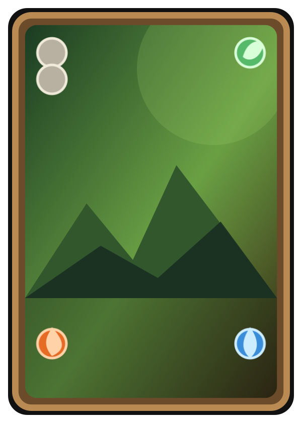
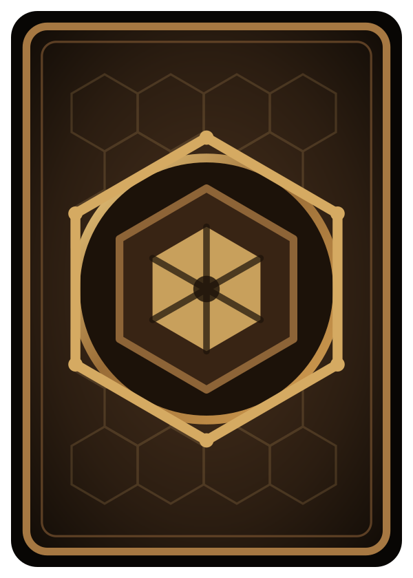

[Back](../../README.md)

# Terrengkort

## Navigasjon

* [Aktivt regelutkast](gameidea-working.md)
* [Kongekort](king-cards.md)
* [Monsterkort](monster-cards.md)

---

Terrengkort bygger kartet og gir ressurskapasitet. Korttypen leses av terrengrammen og baksiden. Elementfokus styrer fargestemning og hvilke ressursikoner som dominerer kortflaten. Intern tier brukes bare i kortlisten og ID-en, ikke på selve kortet.

PNG-bildene under viser kortpreviewene. SVG-kildene ligger i [`images/svg/`](images/svg/), og ikonene ligger i [`images/svg/icons/`](images/svg/icons/).

 

## Ikoner

* Nøytral: stein/sirkel
* Gress: blad
* Flamme: flamme
* Vann: dråpe

## Kortliste

| kort_id | elementfokus | intern_tier | nøytral | gress | flamme | vann |
|---|---|---:|---:|---:|---:|---:|
| `terrain_neutral_1_a` | nøytral | 1 | 1 | 0 | 0 | 0 |
| `terrain_neutral_1_b` | nøytral | 1 | 1 | 1 | 0 | 0 |
| `terrain_neutral_1_c` | nøytral | 1 | 1 | 0 | 1 | 0 |
| `terrain_neutral_1_d` | nøytral | 1 | 1 | 0 | 0 | 1 |
| `terrain_neutral_1_e` | nøytral | 1 | 2 | 1 | 0 | 0 |
| `terrain_neutral_2_a` | nøytral | 2 | 2 | 0 | 1 | 0 |
| `terrain_neutral_2_b` | nøytral | 2 | 2 | 0 | 0 | 1 |
| `terrain_neutral_2_c` | nøytral | 2 | 3 | 1 | 1 | 1 |
| `terrain_grass_1_a` | gress | 1 | 0 | 1 | 0 | 0 |
| `terrain_grass_1_b` | gress | 1 | 1 | 1 | 0 | 0 |
| `terrain_grass_1_c` | gress | 1 | 1 | 2 | 0 | 0 |
| `terrain_grass_2_a` | gress | 2 | 2 | 2 | 0 | 1 |
| `terrain_flame_1_a` | flamme | 1 | 0 | 0 | 1 | 0 |
| `terrain_flame_1_b` | flamme | 1 | 1 | 0 | 1 | 0 |
| `terrain_flame_1_c` | flamme | 1 | 1 | 0 | 2 | 0 |
| `terrain_flame_2_a` | flamme | 2 | 2 | 1 | 2 | 0 |
| `terrain_water_1_a` | vann | 1 | 0 | 0 | 0 | 1 |
| `terrain_water_1_b` | vann | 1 | 1 | 0 | 0 | 1 |
| `terrain_water_1_c` | vann | 1 | 1 | 0 | 0 | 2 |
| `terrain_water_2_a` | vann | 2 | 2 | 0 | 1 | 2 |
